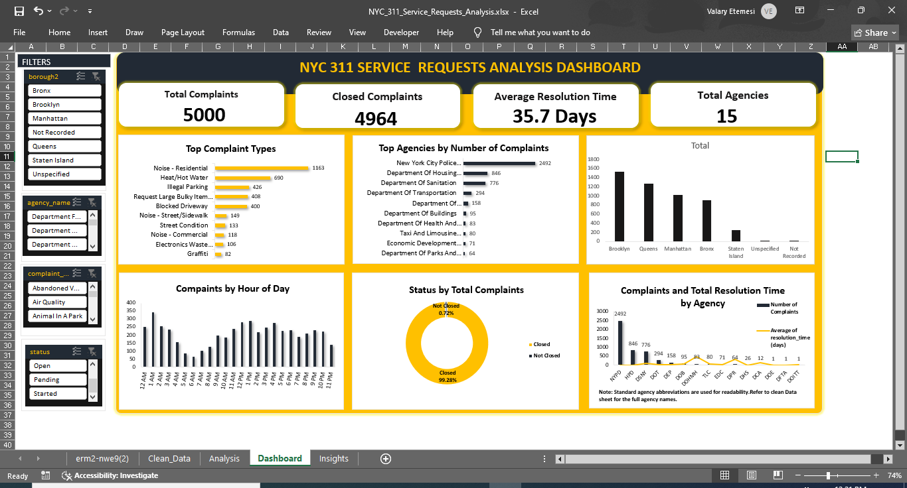

# NYC 311 Service Requests Analysis Dashboard

An exploratory data analysis of 5,000 NYC 311 Service Requests, built entirely in Microsoft Excel 2019. The project covers data cleaning with Power Query, exploratory analysis using PivotTables, and an interactive dashboard tracking complaint trends, agency performance, complaint status, borough distribution, and service resolution time.

## Dashboard Preview



## Objectives

- Analyze complaint distribution across NYC boroughs
- Identify the most common complaint types
- Compare agencies by complaint volume and average resolution time
- Examine complaint status distribution
- Identify peak complaint submission hours

## Data Source

| | |
|---|---|
| **Source** | NYC Open Data — 311 Service Requests |
| **Format** | CSV |
| **Records Analyzed** | 5,000 |

## Dataset Description

| Column | Description |
|---|---|
| Unique Key | Unique complaint identifier |
| Created Date | Complaint submission date and time |
| Closed Date | Complaint closure date and time |
| Borough | Complaint borough |
| Agency | Responsible agency |
| Complaint Type | Complaint category |
| Descriptor | Detailed complaint description |
| Status | Complaint status |
| Resolution Time (Days) | Days taken to resolve the complaint |

## Tools Used

- Microsoft Excel 2019
- Power Query
- PivotTables
- PivotCharts
- Excel Slicers
- Linked KPI Cards

## Project Structure

```
NYC-311-Service-Requests-Analysis/
├── NYC_311_Service_Requests_Analysis.xlsx
├── Dashboard.PNG
└── README.md
```

## Dashboard KPIs

| Metric | Value |
|---|---|
| Total Complaints | 5,000 |
| Closed Complaint Rate | 99.3% |
| Average Resolution Time | 35.7 days |
| Total Agencies | 15 |

## Dashboard Features

- Complaint status distribution
- Top complaint types
- Complaints by borough
- Top complaint descriptors
- Complaints by hour of day
- Complaints and average resolution time by agency
- Interactive slicers

## Key Findings

1. Brooklyn recorded the highest number of service requests, followed by Queens and Manhattan.
2. Noise-related complaints were the most frequently reported complaint category in the sample.
3. 4,964 out of 5,000 complaints were closed, representing approximately 99.3% of the sample.
4. NYPD handled the largest number of complaints among the agencies analyzed.
5. Complaint volumes varied considerably throughout the day, with noticeable peaks during daytime and afternoon hours.
6. Agency workload and resolution performance varied considerably, indicating differences in both complaint volume and service resolution times.


## Business Recommendations

- Prioritize resources and response capacity in high-volume boroughs such as Brooklyn and Queens.
- Focus operational planning on the most frequently reported complaint categories, particularly noise-related complain.
- Monitor agencies handling the highest complaint volumes to ensure adequate staffing and service capacity.
- Investigate agencies with  longer average resolution  times to identify potential process or resource constraints.
- Align staffing and operational resources with periods of higher complaint activity throughout the day.
- Continue monitoring closure rates while investigating  the relatively small proportion of unresolved requests.


## How to Use

1. Open the Excel workbook.
2. Navigate to the **Dashboard** sheet.
3. Use the slicers to filter the analysis.
4. Explore the PivotTables in the **Analysis** sheet.

## Excel Skills Demonstrated

- Power Query
- Pivot Tables
- Pivot Charts
- Slicers
- Dynamic KPI cards (linked to PivotTable cells)
- Dashboard design

## Limitations

- Analysis is based on a sample of 5,000 records.
- Results may not represent the entire NYC 311 dataset.
- Agencies with few complaints should be interpreted cautiously.

## Author

**Valary Shikanda Etemesi**
Freelance Data Analyst | IT Support Specialist

- LinkedIn: [valary-shikanda](https://www.linkedin.com/in/valary-shikanda-aa90162ba)
- GitHub: [@Valary-Shikanda](https://github.com/Valary-Shikanda)

*Built entirely in Microsoft Excel 2019.*
